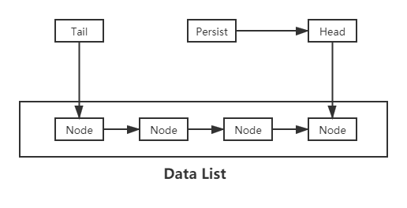

# River

## 介绍
river is a message queue.

## 实现
#### 如何实现一个队列
需要2个tcp server   
tcp server 1，从发送的 client 接受数据  
tcp server 2，发送数据给监听的 client  

#### 工作原理
首先需要4个链表结构：
1. DataList —— 缓存的数据队列
2. ConsumingList —— 正在消费数据的队列
3. GarbageList —— 等待清理的队列
4. FreeList —— 空闲的节点队列

工作原理如下：
1. 提交数据：从FreeList 取出一个节点，写入数据，然后将该节点放入DataList 链表尾部。
2. 消费数据：取出Head 指针指向的节点，放入ConsumingList 中，Head指针向后移动一位。  
3. 消费完成：当消费者正确返回ack，则将ConsumingList 中该数据对应的节点取出放入 GarbageList，等待清理。 
4. 消费异常：消费者如果没有正确返回ACK，则将消费队列中的对应节点添加到 DataList 头部
5. 持久化：持久化指针，一开始指向Head 节点，每持久化成功一个节点，则向后移动一位。如果指向的节点被消费掉，则被指向 head 节点。
6. 数据清理：Trash 指针指向 GarbageList 链表的头部，对加入到该链表的数据进行清理。从磁盘中找到持久化数据并删除，然后将节点放入FreeList。

#### 持久化数据的结构
如何存储持久化的数据，并且还要做到易于查找。

#### 如何控制占用的内存大小
由于每个节点的大小是固定的，只需要控制各个链表的长度即可。

#### 结构图
